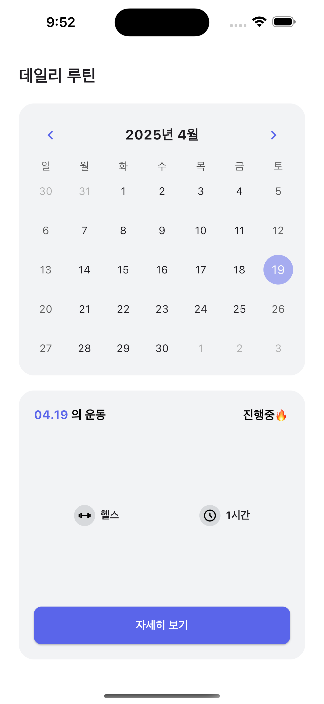
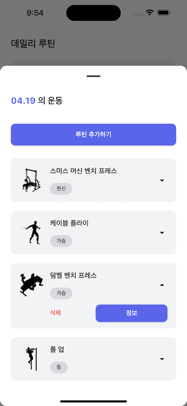
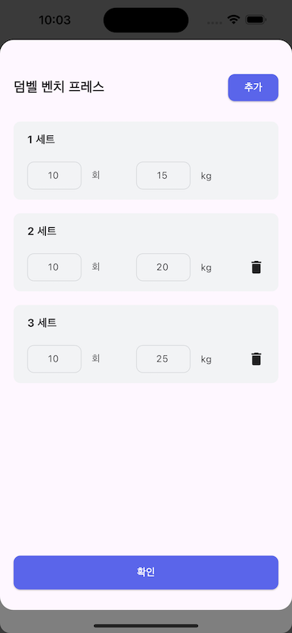
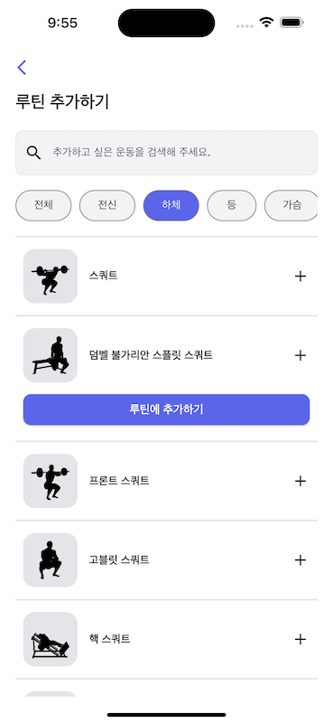

# 💪 Gymmy - 개인화 운동 기록 앱

본 프로젝트는 사용자의 **운동 루틴을 체계적으로 계획하고 기록**할 수 있도록 돕는 개인 맞춤형 헬스 트래커 앱입니다.

---

## 🧠 핵심 아이디어

> "사용자의 운동 루틴을 날짜별로 기록하고, 부위별로 세분화된 운동 계획을 세울 수 있다."

- 사용자가 원하는 날짜에 운동 루틴을 설정
- 운동 부위별로 분류 및 선택 가능 (전신, 하체, 가슴 등)
- 각 루틴에 대해 **세트 수, 횟수, 중량** 자유 설정 가능
- 모든 기록은 **날짜 기반으로 저장**되어 추후 확인 및 수정 가능

---

## 📱 주요 기능

### 🗓️ 홈 (데일리 루틴 개요)
- 달력 기반 UI로 오늘 포함 각 날짜별 운동 루틴 확인 가능
- 운동 종류, 소요 시간 등의 요약 정보 제공
- 운동 진행 상태(`진행중🔥`) 표시

---

### 📋 루틴 목록 화면
- 선택된 날짜에 등록된 루틴 리스트를 확인 가능
- 각 운동은 **부위 태그**, **삭제/정보 버튼**과 함께 제공됨
- 운동을 누르면 상세 세트 기록으로 이동

---

### 🔢 세트 입력 화면
- 각 운동에 대해 세트별로 **횟수, 중량(kg)** 입력 가능
- 세트는 자유롭게 추가/삭제 가능
- 입력 후 확인 버튼으로 저장

---

### ➕ 루틴 추가 화면
- 전신, 하체, 가슴, 등 등 **운동 부위별 필터** 제공
- 원하는 운동을 선택 후 루틴에 추가 가능
- 직관적인 UI로 운동 추가 흐름 간소화

---

## 🛠 사용 기술

| 영역 | 기술 |
|------|------|
| 프론트엔드 | **Flutter** |
| 상태관리 | **BLoC (flutter_bloc)** |
| 로컬 DB | **Hive** |

---

## 🙌 기여자

- 🧑‍💻 개발 및 설계: [ggalmury (GitHub)](https://github.com/ggalmury)

---

## 📎 참고

- [레포지토리 바로가기](https://github.com/ggalmury/gymmy-client)
- 모든 데이터는 Hive 기반 로컬 스토리지에 저장되며, 사용자는 이전 운동 기록을 확인하거나 새로운 루틴을 설정할 수 있습니다.

